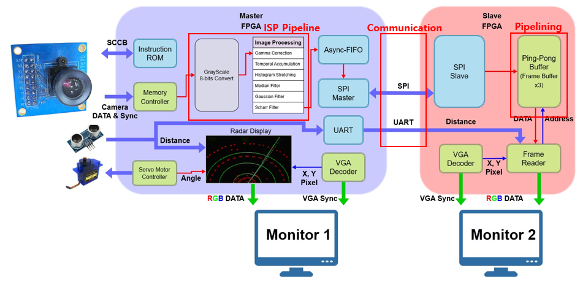

# 🌙 FPGA Based Adaptive Digital Night Vision System

<div align="center">


**Real-time 320×240 QVGA ISP Pipeline 설계**

*저조도 환경에서 일반 카메라만으로 물체 윤곽선을 실시간 추출하는 FPGA 기반 야간 시야 확보 시스템*

</div>

---

## 👥 팀 구성 및 역할

| 팀원 | 담당 역할 |
|------|-----------|
| **오수혁** (팀장)       |FPGA Timing Closure · Gaussian Filter · 초음파 센서 Driver · 3단 Ping Pong buffer 설계 · Line Buffer 알고리즘 |
| **박인범** | SCCB 설계 및 레지스터 제어 · Servo Motor Driver · Temporal Accumulation · Scharr Filter · Histogram Stretching |
| **손민재** | 시스템 아키텍쳐 설계 및 통합 · ISP 파이프라인 제어 로직 설계 · 통신 프로토콜 UVM 검증 · Coverage 분석 및 충족 · HW 테스트 및 최적화
| **최무영** | Gamma Correction · Median Filter · Radar 알고리즘 및 Overlay 설계 · HW 테스트 및 최적화 |

---

## 📋 목차

1. [프로젝트 개요](#-프로젝트-개요)
2. [시스템 구성](#-시스템-구성)
3. [ISP 파이프라인](#-isp-파이프라인)
4. [레이더 오버레이](#-레이더-오버레이)
5. [성능 최적화](#-성능-최적화)
6. [FPGA 리소스 활용](#-fpga-리소스-활용)
7. [UVM 검증](#-uvm-검증)
8. [트러블슈팅](#-트러블슈팅)
9. [레포지토리 구조](#-레포지토리-구조)

---

## 🎯 프로젝트 개요

### 배경

야간투시경은 **Optics → Sensor → FPGA → Display** 의 연계로 이루어진 기술 집약체입니다.  
현대에는 열화상 센서, 광증폭관, 증강현실까지 결합된 최첨단 야간 투시 기술이 활용되고 있습니다.

> **왜 FPGA인가?**  
> CPU는 고전력 범용 프로세서로 대규모 병렬 연산에 한계가 있어 이미지 처리 병목이 발생합니다.  
> FPGA는 저전력 병렬 하드웨어로 **공간적 병렬 처리(Spatial Parallelism)** 가 가능해 실시간 이미지 처리에 최적화되어 있습니다.

### 목표

- ✅ 고가의 특수 장비 또는 고성능 연산 시스템 의존 없이 구현
- ✅ **일반 카메라** 기반 저조도 환경 시인성 확보 영상처리 로직 설계
- ✅ **저비용 하드웨어(Basys3)** 환경에서 실시간 구동 가능한 시스템 구현

### 활용 분야

| 분야 | 설명 |
|------|------|
| 🚗 야간 자율주행 | 카메라 센서가 야간에도 도로 표지판, 보행자, 장애물을 정확히 인식 |
| 🏭 산업현장 안전관리 | 조명 부족한 지하 작업장, 야간 건설 현장에서 객체 검출 성능 향상 |

---

## 🔧 시스템 구성

### 사용 환경

| 분류 | 항목 |
|------|------|
| **언어** | SystemVerilog, Python |
| **도구** | Verdi (Synopsys), VIVADO |
| **FPGA** | Xilinx Basys3 (Artix-7) × 2 |
| **카메라** | OV7670 |
| **초음파 센서** | HC-SR04 |
| **서보 모터** | SG90 |

### 하드웨어 스펙

#### Camera (OV7670)
- SCCB Protocol 활용 레지스터 설정
- **30fps @25MHz** 클럭 동작
- 센서 게인 및 노출 시간 동적 제어
- 320×240 QVGA 데이터 포맷

#### FPGA (Basys3)
- Master Board – Slave Board **분할 프로세싱**
- **100MHz** 클럭 동작
- Master Board: 다중 주변장치 제어 및 영상처리
- Slave Board: QVGA 영상 출력

#### Ultrasonic Sensor (HC-SR04)
- Time of Flight 거리 측정
- **10Hz** 주기 동작
- **3cm ~ 255cm** 거리 측정 가능

#### Servo Motor (SG90)
- PWM 제어
- **0~180° 1° 간격** 정밀 회전 제어
- 수동/자동 모드 선택 지원

### 전체 시스템 아키텍처




### Master Board

**Real-time Processing & Multi-Peripheral Control**

1. **센서 인터페이스 및 전처리** - 카메라 영상 실시간 수신 및 Grayscale 변환, 초음파 센서 거리 데이터 획득
2. **실시간 이미지 파이프라인** - Spatial Filter의 Pipeline 연결로 저조도 영상 화질 개선
3. **다중 주변장치 동시 제어** - 버튼 입력 Servo Motor PWM 제어, 필터 처리된 영상 데이터 SPI 송신, 초음파 센서 거리 데이터 UART 송신

### Slave Board

**Frame Buffering & Display Management**

1. **고속 스트리밍 데이터 수신** - Master Board에서 전송되는 영상 데이터 실시간 수신
2. **프레임 버퍼 관리** - 수신된 픽셀 데이터를 내부 메모리(BRAM)에 버퍼링, Hand-Shaking 버퍼 구조로 30fps 확보
3. **독립적 디스플레이 출력** - 버퍼에 저장된 프레임 데이터를 순차적으로 읽어와 VGA 디코더를 통해 모니터 출력

---

## 🖼️ ISP 파이프라인

### 필터 구성 요약

| 필터 | 주요 기능 | 상세 |
|------|-----------|------|
| **Grayscale Conversion** | 색상 데이터 변환 | RGB565 → 8-bit Grayscale, 비트 연산 기반 경량 구현 |
| **Gamma Correction** | 저조도 환경 휘도 보정 | 인간의 시각 특성에 맞게 밝기 보정 (Night Mode: γ=0.35) |
| **Temporal Accumulation** | 화이트 노이즈 제거 | 프레임 간 누적을 통해 화이트 노이즈 제거, α=0.125 EMA |
| **Histogram Stretching** | 대비 확장 | 매 프레임 최소/최대 밝기를 추적하여 0~255 범위로 확장 |
| **Median Filter** | 임펄스 노이즈 제거 | 3×3 커널의 중앙값 추출하여 Impulse Noise 제거 |
| **Gaussian Filter** | 노이즈 제거 | 3×3 가우시안 커널, 가중치 평균을 이용한 스무딩 |
| **Scharr Filter** | 정밀 에지 추출 | 회전 대칭성 연산으로 정밀한 경계선 기울기 계산 |

### 파이프라인 처리 흐름

```
OV7670 Camera
     │
     ▼
Grayscale Conversion (RGB565 → 8-bit)
     │
     ▼
Gamma Correction (LUT 기반, Night/Normal 자동 전환)
     │
     ▼
Temporal Accumulation (Frame Buffer BRAM, EMA 누적)
     │
     ▼
Histogram Stretching (Dynamic min/max 추적)
     │
     ▼
Median Filter (3×3 Sorting Network, 2× Line Buffer)
     │
     ▼
Gaussian Filter (3×3 Kernel, 2-Stage Pipeline)
     │
     ▼
Scharr Edge Filter (Gx, Gy 계산, 임계값 기반 이진화)
     │
     ▼
Morphology (Erosion / Dilation)
     │
     ▼
Async FIFO → SPI → Slave Board
```

### 각 필터 설명

#### 🌙 Gamma Correction
비선형 밝기 변환 함수를 통해 어두운 영역의 휘도를 증폭시키고, 인간의 시각 특성에 맞게 전체적인 톤을 보정합니다.

- **256-entry LUT (ROM)** 기반 구현으로 복잡한 연산 없이 1클럭 접근
- **Night Mode (Bank 1)**: γ=0.35, Target Scale=240으로 저조도 환경 강화
- **Normal Mode (Bank 0)**: 선형 응답 (Identity)
- 프레임 평균 휘도를 누적하여 **자동 모드 전환**

#### 🕐 Temporal Accumulation
여러 프레임의 데이터를 겹쳐, 변화가 없는 픽셀은 정지로 판단하여 강조하고, 변화한 픽셀은 이동으로 판단해 현재 프레임만 사용합니다.

```
NEW_AVG = OLD_AVG - (OLD_AVG >> 3) + (CURRENT >> 3)
```

- **BRAM 기반 Frame Buffer** (76,800 픽셀, 8-bit)
- EMA(지수 이동 평균) α=0.125로 화이트 노이즈 제거

#### 📊 Histogram Stretching
현재 프레임의 밝기를 분석하여 특정 구간에 집중된 픽셀 값을 0~255의 전체 범위로 확장 후 다음 프레임에 반영합니다.

```
output = (input - min) × 255 / (max - min)
```

- vsync 엣지마다 min/max 갱신
- 3-Stage Pipeline으로 나눗셈 연산 처리

#### 🔵 Median Filter (3×3)
3×3 커널 내의 중앙 픽셀값을 선택하여, 선명도를 유지하면서 임펄스 노이즈를 효과적으로 제거합니다.

- 2개의 **Line Buffer** (각 320픽셀)로 3×3 윈도우 구성
- Sorting Network 기반 병렬 정렬
- 중앙값과 원본 차이가 임계값 초과 시에만 교체 (선택적 적용)

#### 🌊 Gaussian Filter (3×3)
```
커널:
[ 1  2  1 ]
[ 2  4  2 ] × (1/16)
[ 1  2  1 ]
```
- 2개의 **Line Buffer**로 3×3 윈도우 구성
- 2-Stage Pipeline으로 합산 및 정규화 처리
- 비트 시프트로 /16 연산 구현 (`sum[11:4]`)

#### ✏️ Scharr Edge Filter
수평, 수직 방향의 미분값(기울기)을 구하여, 기준치 이상의 값이 도출되었을 때 Edge로 판단합니다.

```
Horizontal:         Vertical:
[ -3   0   3 ]     [ -3  -10  -3 ]
[ -10  0  10 ]     [  0    0   0 ]
[ -3   0   3 ]     [  3   10   3 ]

abs_G = |Gx| + |Gy|
if (abs_G > threshold) → WHITE (Edge)
else                   → BLACK
```

- btnU/btnD로 **임계값 실시간 조정** (25 단위, 범위: 0~1200)

### 결과 이미지

처리 전 (원본 저조도) → 처리 후 (윤곽선 추출):

```
[완전히 어두운 화면]  →  [야간 투시 형태로 물체 윤곽이 선명하게 표시]
```

어두운 환경에서 노이즈가 제거된 상태로 물체의 윤곽선(Edge)이 뚜렷하게 추출됨을 확인할 수 있습니다.

---

## 📡 레이더 오버레이

초음파 센서(HC-SR04)와 서보 모터(SG90)를 연동하여 실시간 레이더 디스플레이를 구현합니다.

### 동작 원리

```
서보 모터 각도(0~180°) + 초음파 거리(0~255cm)
         │
         ▼
   극좌표 → 직교좌표 변환
   x = center_x ± (dist × cos(θ))
   y = center_y - (dist × sin(θ))
         │
         ▼
   VGA 픽셀 좌표에 레이더 요소 렌더링
   ├── 동심원 (distance rings): r² 비교
   ├── 와이퍼 선 (sweep line): 삼각함수 비교
   └── 탐지 점 (red dots): 좌표 매핑
```

### 파이프라인 구조 (4-Stage, Timing Closure)

| Stage | 연산 내용 |
|-------|-----------|
| Stage 1 | 각도별 sin/cos ROM 조회, 거리 스케일링 |
| Stage 2 | 곱셈 (dist × cos, dist × sin) |
| Stage 3 | 비율 보정, 중심점 이동, 좌표 확정 |
| Stage 4 | 배열 메모리에 좌표 기록 |

- **sin/cos ROM**: 90-entry LUT, 10-bit 정밀도
- **181개 각도 동시 렌더링**: `generate` 블록으로 병렬 처리
- 동심원 3개 (r=80, 160, 240px), 와이퍼 선, 빨간 점으로 구성

---

## ⚡ 성능 최적화

### Timing Closure
Negative Slack 문제 해결을 위해 파이프라인을 도입하여 타이밍 마진을 확보했습니다.

| 항목 | 수정 전 | 수정 후 |
|------|---------|---------|
| Worst Negative Slack (WNS) | -6.662 ns | +0.123 ns |
| Total Negative Slack (TNS) | -16378.265 ns | 0 ns |
| Failing Endpoints | 5762 / 8400 | 0 / 8889 |

### Parallel Access
**Dual-port BRAM** 접근 방식을 통해 읽기/쓰기 병렬 처리를 구현하여 데이터 병목을 제거했습니다.

### CDC Protection
**2단 플립플롭 동기화 장치**를 적용하여 비동기 클럭 도메인 간의 데이터 안정성을 보장합니다.

- pclk (카메라 25MHz) ↔ clk_100m (시스템 100MHz)
- Async FIFO (Gray-code pointer synchronization) 적용
- SPI sclk ↔ clk_100m 간 2-FF 동기화

---

## 📊 FPGA 리소스 활용

### Master Board

| 리소스 | 사용률 |
|--------|--------|
| LUTs (Logic Density) | **73%** |
| BRAM (Memory) | **53%** |
| IO (Connectivity) | **51%** |
| Registers (FF) | **29%** |
| MMCM / Clocking | **20%** |

### Slave Board

| 리소스 | 사용률 |
|--------|--------|
| BRAM (Ping-Pong Buffer) | **75%** |
| IO (Interface) | **27%** |
| Global Clock (BUFG) | **6%** |
| LUTs (Logic) | **2%** |

> **설계 결정**: 단일 보드에서 Radar Overlay와 3단 Frame Buffer를 동시에 구현 시 BRAM 사용률이 **120%** 를 초과하여, Master/Slave 분할 아키텍처를 채택했습니다.

---

## 🧪 UVM 검증

### SCCB Protocol 검증

OV7670 레지스터 설정 전 과정을 UVM으로 검증했습니다.

| 항목 | 결과 |
|------|------|
| Total TX | 77 / 77 |
| Pass Rate | **100%** |
| Functional Coverage | **100%** |
| 검증 범위 | 1 Transaction = 3 Byte (IP Address + Sub-address + Write Data) |

- **77 Transaction = 231 Byte** 전체 레지스터 설정 데이터 검증 완료

### SPI + FIFO 검증

| 항목 | 결과 |
|------|------|
| Test Scenario | Random data 256회 |
| Pass / Fail | **256 / 0** |
| TX Coverage | **100%** |
| RX Coverage | **100%** |
| 데이터 범위 | 8-bit 전 범위 (zero, low, mid_lo, mid_hi, high, ff) hit 완료 |

---

## 🔧 트러블슈팅

### 1. [Resource] FPGA Utilization 한계

- **Issue**: Radar Overlay와 동시에 프레임 버퍼링(BRAM) 진행 시 BRAM 점유율 120% 초과
- **Analysis**: 단일 보드에서 3단 프레임 버퍼링과 디스플레이 출력을 동시에 수행
- **Solution**: Radar(Master)와 버퍼링/출력(Slave)으로 보드를 분리하여 메모리를 분산

### 2. [Signal Integrity] SPI 고속 통신 시 물리적 신호 왜곡

- **Issue**: Master-Slave 보드 간 영상 데이터 전송 시 간헐적 데이터 유실 발생
- **Analysis**: 고속 스위칭 시 발생하는 RC Delay로 인해 Rising Edge가 왜곡되는 물리적 한계
- **Solution**: 실시간 처리를 저해하지 않는 마지노선인 **16.6MHz** 로 통신 클럭 주파수를 낮춰 신호 무결성 확보

### 3. [Architecture] 다중 필터 직렬 연결 시 데이터 동기화 문제

- **Issue**: Line Buffer 및 Frame Buffer 기반 여러 IP를 Cascade 연결했을 때 연산 Latency 차이로 인한 데이터 꼬임 발생
- **Analysis**: 각 필터의 처리 시간이 달라, 픽셀 단위로 데이터를 밀어 넣을 경우 타이밍 위반
- **Solution**: 모듈 간 데이터 유효성을 검증하는 **Valid 신호 기반의 Handshaking** 을 도입하여 Pipelining 구현

### 4. [Timing Violation] 오버레이 픽셀 스케일링 중 Negative Slack 발생

- **Issue**: 화면에 오버레이를 띄우기 위한 픽셀 스케일링 단계에서 타이밍 위반 경고 및 동작 실패
- **Analysis**: 스케일링 연산을 담당하는 Combinational Logic이 너무 비대해져 한 클럭 사이클 내에 신호가 도달하지 못하는 Setup Time Violation
- **Solution**: 거대한 조합 논리 경로 사이에 **파이프라인 레지스터(FF)를 분할 삽입** 하여 Critical Path를 단축 (WNS: -6.662ns → +0.123ns)

---

## 📁 레포지토리 구조

```text
.
├── README.md
├── docs/
│   ├── architecture/
│   ├── diagrams/
│   ├── presentation/
│   └── references/
├── rtl/
│   ├── common/
│   ├── master/
│   │   ├── top_VGA_OV7670.sv       # Master Top Module
│   │   ├── ISP.sv                  # ISP Pipeline Controller
│   │   ├── OV7670_MemController.sv # Camera Interface
│   │   ├── SCCB_Register_set.sv    # Camera Register Config
│   │   ├── gamma_LUT_correct.sv    # Gamma Correction
│   │   ├── temporal_accumulation.sv # Temporal Filter
│   │   ├── dynamic_stretching.sv   # Histogram Stretching
│   │   ├── median_filter.sv        # Median Filter
│   │   ├── Gaussian_filter.sv      # Gaussian Filter
│   │   ├── Sharr_filter.sv         # Scharr Edge Filter
│   │   ├── morphology.sv           # Erosion/Dilation
│   │   ├── overlay_all.sv          # Radar Overlay
│   │   ├── servo_motor_controller.sv
│   │   ├── ultrasonic.sv
│   │   ├── spi_master.sv
│   │   ├── async_fifo.sv
│   │   ├── VGA_Decoder.sv
│   │   └── filter_sel.sv
│   ├── slave/
│   │   ├── TOP_VGA.sv              # Slave Top Module
│   │   ├── slave_top.sv            # SPI Rx + Addr Gen
│   │   ├── spi_slave.sv
│   │   ├── spi_rx_fifo.sv
│   │   ├── PingPong_Buffer.sv      # Triple Frame Buffer
│   │   ├── frameBuffer.sv
│   │   ├── ImgMemReader.sv
│   │   ├── VGA_Decoder.sv
│   │   └── uart_top.sv
│   └── common/
│       ├── fifo.sv
│       ├── i2c_master.sv
│       └── baud_tick_gen.sv
├── tb/
│   ├── sccb_i2c/                       # UVM Testbench (SCCB)
│   └── spi_fifo_loopback/                        # UVM Testbench (SPI)
├── constraints/
│   ├── master/basys3.xdc
│   └── slave/basys3.xdc
├── scripts/
│   └── vivado/
└── images/
```

---

## 🚀 시작하기

### 요구사항

- Xilinx Vivado 2020.2 이상
- Basys3 보드 × 2
- OV7670 카메라 모듈
- HC-SR04 초음파 센서
- SG90 서보 모터
- VGA 모니터 × 2

### 빌드 방법

```bash
# 1. Vivado 프로젝트 생성 후 RTL 소스 추가
# Master Board: rtl/master/ 의 모든 .sv 파일
# Slave Board:  rtl/slave/  의 모든 .sv 파일

# 2. Constraints 파일 적용
# Master: constraints/master/basys3.xdc
# Slave:  constraints/slave/basys3.xdc

# 3. 합성 및 구현
# Run Synthesis → Run Implementation → Generate Bitstream

# 4. 프로그래밍
# Master Board → Slave Board 순서로 프로그래밍
```

### 슬라이드 스위치 설정 (Master Board)

| 스위치 | 기능 |
|--------|------|
| SW[0] | Gamma Correction ON/OFF |
| SW[1] | Histogram Eqaulization ON/OFF |
| SW[2] | Median Filter ON/OFF |
| SW[3] | Gaussian Filter ON/OFF |
| SW[4] | Scharr Edge Filter ON/OFF |
| SW[5] | Erosion ON/OFF |
| SW[6] | Dilation ON/OFF |
| SW[7] | Temporal Accumulation ON/OFF |
| SW[8] | Histogram Stretching ON/OFF |
| SW_SERVO | 서보 모터 수동/자동 모드 |
| SW_SCALE | 레이더 스케일 전환 |
| btnU / btnD | Scharr 임계값 조정 |
| btnL / btnR | 서보 모터 수동 제어 |

---

<div align="center">

**FPGA Night Vision Project | 2026.03**

*Basys3 (Artix-7) · SystemVerilog · Vivado · Synopsys Verdi*

</div>
