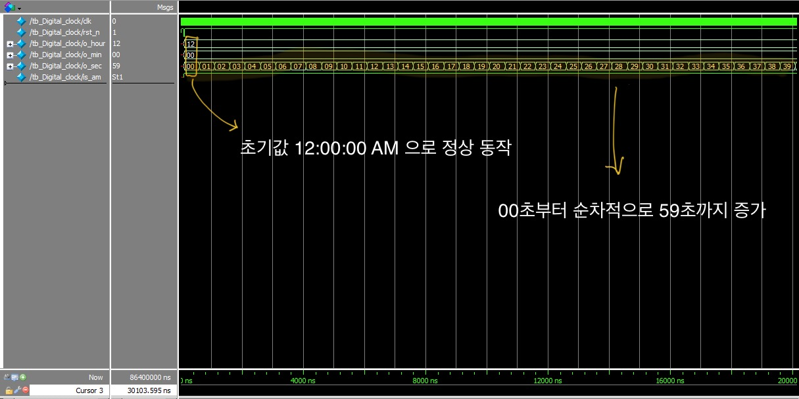
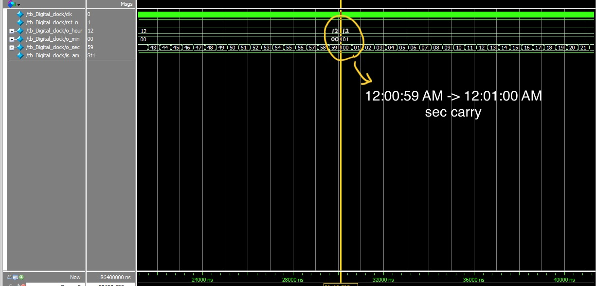
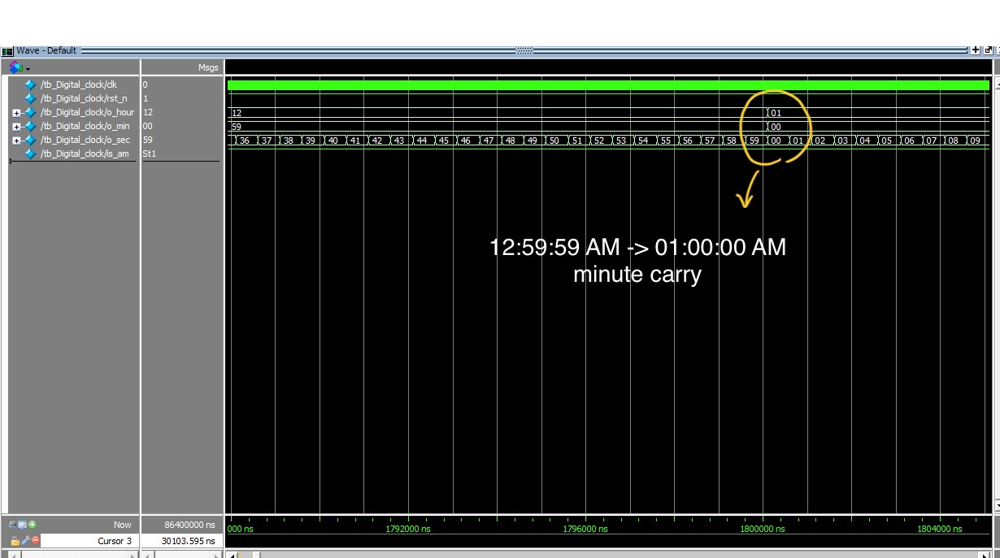
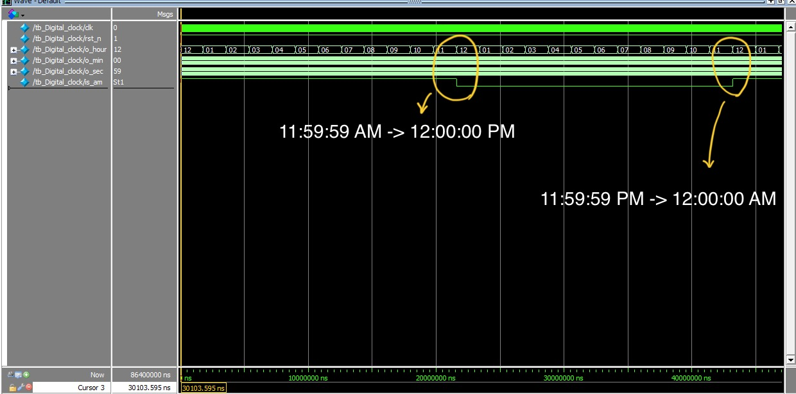
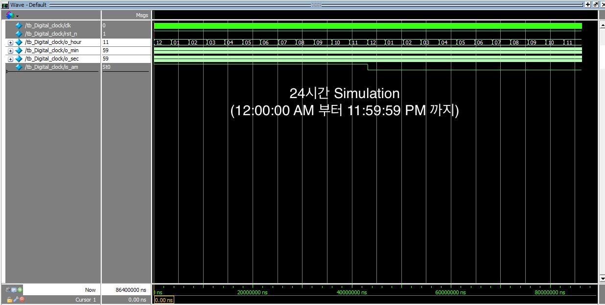

# Project_01_Digital_Clock

## 1. 프로젝트 개요

이 프로젝트는 12시간 형식의 디지털 시계를 모듈화를 중점적으로 구현하였습니다. 시스템 클럭을 분주하여 1초 단위의 시간을 생성하고, 이를 기반으로 시, 분, 초를 카운트하며 AM/PM을 전환하는 기능을 포함합니다.
초기에는 하나의 `always` 블록에 모든 로직을 몰아넣은 단일 모듈 방식으로 설계했으나, **기능 확장과 디버깅, 재사용성 측면에서 한계를 느꼈고**, 이를 개선하고자 구성요소를 역할별로 분리하여 **모듈화된 구조**로 다시 설계하였습니다. 이를 통해 보다 **직관적이고 유지보수가 쉬운** 설계로 발전시킬 수 있었습니다.

---

## 2. 설계 목표

* 클럭 분주기를 통한 정확한 시간 생성 (1Hz)
* BCD 카운터를 활용한 시, 분, 초 계산
* AM/PM 자동 전환 로직 구현 (12시간 형식)

---

## 3. 설계 구현

### 3.1. 모듈 구성

디지털 시계는 다음과 같은 주요 모듈로 구성됩니다.
| 모듈 이름         | 설명                                                                 |
|------------------|----------------------------------------------------------------------|
| `clk_divider`    | 펄스 발생기(pulse generator)를 통해 시스템 클럭을 1Hz 주기로 분주합니다.   |
| `BCD_counter_60` | 00부터 59까지 BCD 형식으로 초 및 분을 카운트하며, 59에서 00으로 roll-over 시 carry 신호를 발생합니다. |
| `BCD_counter_12` | 01부터 12까지 BCD 형식으로 시간을 카운트하며, 12에서 1로 넘어갈 때 carry 신호를 발생합니다. |
| `am_pm_logic`    | AM/PM 상태를 관리하며, 12시 정각마다 AM과 PM을 토글합니다.|
| `Digital_clock` | 위의 네 가지 모듈의 연결을 위한 top_module |
| `tb_Digital_clock` | 시계의 동작 확인을 위한 24시간 동안의 테스트벤치 |

### 3.2. AM/PM 로직 상세 및 학습 경험

`am_pm_logic` 모듈은 12시간 형식 디지털 시계의 핵심적인 부분으로, 12시 정각에 AM/PM 상태를 정확히 전환하는 로직을 담당합니다. 초기 설계 과정에서 이 부분의 타이밍에 대한 고민이 있었습니다.

저는 처음에 `am_pm` 상태 전환 조건이 `hour`가 11시일 때 발생해야 다음 클럭 사이클(즉, 12시가 되는 순간)에 AM/PM 상태가 의도한 대로 업데이트될 것이라고 예상했습니다. 이는 `posedge clk` 기반의 동기 시스템에서 레지스터 업데이트가 '예약'되고 다음 사이클에 반영된다는 일반적인 이해 때문이었습니다.

그러나 실제 구현 및 시뮬레이션 결과, `am_pm_logic`의 클럭으로 사용되는 `hr_carry` 신호가 **시간이 11시 59분 59초에서 12시 00분 00초로 넘어가는 바로 그 `posedge` 순간**에 발생하며, 이 클럭 에지에서 `am_pm_logic`은 이미 갱신된 `hour` 값(12시)과 `min_carry` 값을 받아 **바로 그 `posedge` 순간에 AM/PM 상태를 토글**하여 출력한다는 것을 확인하였습니다.

이 과정에서 저는 Verilog 시뮬레이션의 **마이크로-타임스텝(micro-timestep)** 및 **델타 사이클(delta cycle)** 개념의 중요성을 알게 되었습니다.

* **마이크로-타임스텝 / 델타 사이클:** 시뮬레이터는 특정 시간 단위(이번 프로젝트에서는 1초) 내에서 발생하는 여러 이벤트를 **극도로 미세한 논리적 시간 단위(델타 사이클)**로 쪼개어 처리합니다. 이는 하드웨어의 병렬 동작과 신호 전파 지연을 정확히 재현합니다.
* **연쇄적인 동기 업데이트:** `one_hz_pulse`의 `posedge`를 시작으로, 초 카운터 -> 분 카운터 -> 시 카운터 순으로 레지스터들이 연쇄적으로 업데이트되고 캐리 신호가 전파됩니다. `hr_carry`의 `posedge`가 발생하고 `am_pm_logic`이 트리거되는 이 모든 과정이 **`12:00:00`이라는 동일한 논리적 타임스탬프 내에서 발생합니다.**
* **`posedge clk`의 의미 재해석:** 레지스터의 업데이트는 `posedge clk`이라는 순간에 '예약'되고 '완료'됩니다. 즉, 해당 클럭 에지에서 조건이 충족되면, 레지스터의 값은 **바로 그 클럭 에지에서 새로운 값으로 변경되어 다음 로직으로 전파될 준비를 마칩니다.**

이 경험을 통해 동기 시스템에서 여러 모듈 간의 신호 전파 및 레지스터 업데이트 타이밍을 더욱 더 정밀하게 분석하고 설계할 수 있는 역량을 키울 수 있었습니다.

---

## 4. 시뮬레이션 및 검증 결과

시작 직후 12:00:00AM로 초기화되는 것을 볼 수 있고 초(`o_sec`)가 정상적으로 증가하는 것을 확인할 수 있습니다.

---

초(`o_sec`) 카운터가 59에서 00으로 넘어가면서 `sec_carry` 신호가 1이 되고, 이를 통해 **분(`o_min`) 카운터가 증가**함을 확인할 수 있습니다. (sec-rollover)

---

분(`o_min`) 카운터가 59에서 00으로 넘어가면서 `min_carry` 신호가 1이 되고, 이를 통해 **시간(`o_hour`) 카운터가 증가**함을 확인할 수 있습니다. (min-rollover)

---

각각 11:59:59AM -> 12:00:00PM / 11:59:59PM -> 12:00:00AM 으로 AM/PM 전환이 발생하는 것을 확인할 수 있습니다.

---

24시간 동안의 시뮬레이션 결과 정상적으로 동작함을 확인할 수 있습니다.

## 5. 결론
이번 프로젝트를 통해 단순한 시계 동작을 구현을 너머, **모듈화 설계의 필요성과 장점**을 체감하며 구조적 설계에 대한 이해를 더욱 깊이 할 수 있었습니다. 기능을 분리하고 역할별로 모듈화함으로써 회로의 가독성과 유지보수성, 디버깅 효율성 측면에서 이점을 느낄 수 있었습니다.
또한, `am_pm_logic`의 구현 과정에서 **델타 사이클(delta cycle), 마이크로 타임스텝, 신호의 전파 지연, 레지스터 업데이트의 타이밍**과 같은 동기 시스템의 핵심 개념들을 실제 시뮬레이션을 통해 직관적으로 이해할 수 있었으며, 이러한 개념은 앞으로 더 정밀하고 신뢰성 있는 타이밍 분석과 회로 설계에 큰 도움이 될 것이라 생각합니다.

