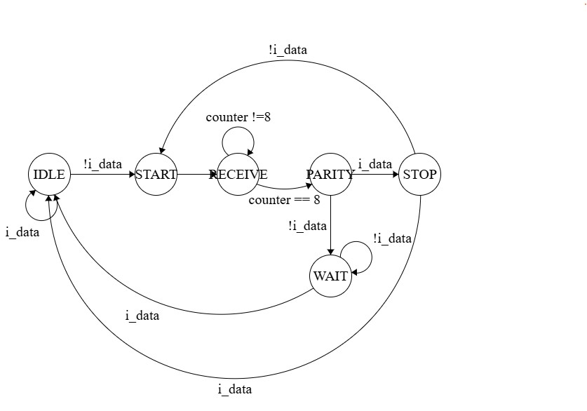
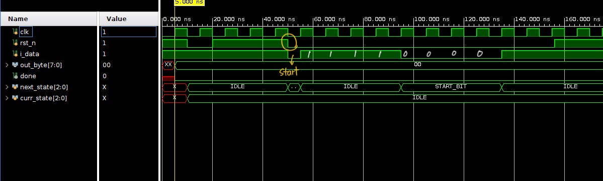
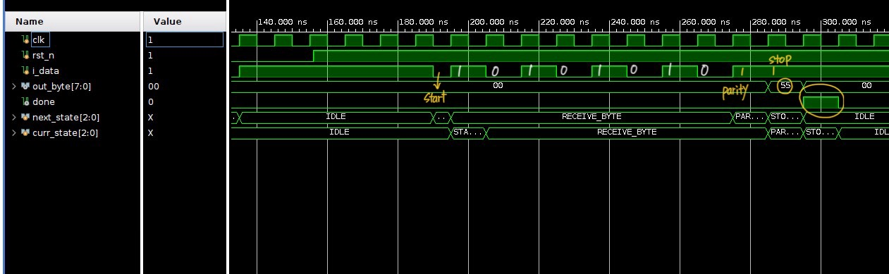

# Project_02_Serial_Rx_Parity

## 1. 프로젝트 개요

이 프로젝트는 **Odd parity 검사를 포함한 8비트 시리얼 수신기(Serial Receiver)**를 구현한 것입니다.  
입력은 `start bit(0) → i_data(8비트, LSB-first) → parity bit(1개) → stop bit(1)`로 구성되어 있으며,  
이를 순차적으로 수신하여 상태를 관리하고 데이터 유효성을 판단하는 **FSM 기반 설계**를 적용하였습니다.
초기에는 하나의 `always` 블록에 모든 로직을 담아 구현했으나, 설계 및 시뮬레이션 중 타이밍 오류나 디버깅의 어려움을 경험하며 **상태별 동작을 명확히 분리한 FSM 구조**로 재설계하였습니다.
8비트를 수신에 있어서 counter 또는 shift register를 통해 제어하는 두 가지 방법 중 이번 프로젝트는 counter를 선택하였습니다.
이를 통해 입력 시점에 따른 데이터 처리 흐름과 조건 분기 처리를 훨씬 직관적으로 구현할 수 있었습니다.

---

## 2. 설계 목표

* `start bit = 0` 감지 시 시리얼 수신 시작
* 시리얼로 전송된 8비트 데이터 수신 (LSB-first)
* 수신된 8비트 데이터 + 1비트 패리티를 통해 **Odd parity 검사 수행**
* `stop bit  =1`이면 데이터 유효성 판별, 유효한 경우 `done` 출력

---

## 3. 설계 구현

### 3.1. 모듈 구성

| 모듈 이름 | 설명 |
|----------|------------|
| `Serial_Receiver_Parity` | 1 byte길이의 데이터를 수신하고 Odd parity check를 통해 데이터의 유효성 판별 |
| `tb_Serial_Receiver_Parity` | 임의의 세 데이터를 수신하고 의도적인 Odd parity check 실패를 통해 유효성 판별에 따라 출력 로직의 정상 기능을 확인 |

### 3.2. FSM 구조

전체 수신 프로토콜을 처리하기 위해 **13개 상태로 구성된 FSM**을 설계하였습니다:

| 상태 이름       | 설명                             |
|----------------|-----------------------------------|
| `IDLE`         | 입력 대기 (i_data = 1 유지)        |
| `START_BIT`    | start bit 수신 (0인지 확인)        |
| `RECEIVE_BYTE`    | 8비트 데이터 순차 수신 완료(LSB first)  |
| `PARITY_BIT`   | 패리티 비트 수신                   |
| `STOP_BIT`     | stop bit 수신 및 패리티 검증       |
| `WAIT`         | stop bit가 1이 아닐 경우 대기 (에러)      |

각 상태는 입력 신호 `i_data`와 클럭 에지(`posedge clk`), `counter`에 따라 다음 상태로 전이됩니다.  
1byte 수신 및 패리티 비트 계산 후, `out_byte`를 통해 수신된 데이터를 출력합니다.

### 3.3. 패리티 검사 및 출력 로직

Odd parity system 이므로 각 데이터 비트들과 parity bit를 합한 `parity_check_bit`의 XOR 연산이 1이면 (1의 개수가 홀수개) Odd parity 조건을 만족하므로 
유효한 데이터로 판단하고 `curr_state`가 `STOP_BIT`일 때, `done=1`을 출력합니다.

```verilog
wire [8:0] parity_check_bit;
assign parity_check_bit = {out_byte, parity};
assign done = (curr_state == STOP_BIT) && ^parity_check_bit;
```
---

## 4. 시뮬레이션 및 검증 결과



해당 프로젝트 FSM의 전체 구조입니다.

---


`rst_n` 의 assertion 이후 `i_data` 를 송신해도 `curr_state` 는 계속 `IDLE` 이므로 `rst_n`이 제대로 동작함을 알 수 있습니다.

`out_byte=8'b0101_0101 (0x55)`, `parity=1`인 경우 Odd parity 조건을 만족하므로 `done =1`을 출력합니다.

---


`start_bit` 후에 1byte의 데이터 0x55 (8'b0101_0101) 수신 확인 및 odd parity check pass 했으므로 `done` 을 assertion 한 것을 확인할 수 있습니다.

---


`start_bit` 후에 1byte의 데이터 0xaa (8'b1010_1010) 수신 확인 및 odd parity check pass 했으므로 `done` 을 assertion 한 것을 확인할 수 있습니다.

---


`start_bit` 후에 1byte의 데이터 0x01 (8'b0000_0001) 수신 확인, odd parity check fail 했으므로 `done` 을 de-assertion 한 것을 확인할 수 있습니다.

{out_byte, parity} = 9'b0_0000_0011  odd parity check fail

---


`start_bit` 후에 1byte의 데이터 0xf0 (8'b1111_0000) 수신 확인, odd parity check pass 했지만 잘못된 `stop_bit`가 수신되었기 때문에 `WAIT`로 전이(transition)하고 `done`을 de-assertion 한 것을 확인할 수 있습니다.


## 5. 결론

이 프로젝트를 통해 **FSM 기반 설계의 실전 적용 경험**을 쌓을 수 있었습니다.  
입력 신호가 시간 순서대로 순차적으로 들어오는 시리얼 통신에서는 **상태에 따라 역할을 나누는 구조적 설계가 중요**함을 체감했습니다.
또한, 패리티 검사와 같은 **간단한 오류 검출 로직을 하드웨어적으로 처리하는 방식**을 구현하면서,  
향후 UART나 기타 시리얼 통신 프로토콜 설계에 필요한 기초를 탄탄히 다질 수 있는 기반이 되었습니다.

FSM 상태 전이 흐름을 명확히 정의하고, 레지스터 업데이트 타이밍을 `posedge clk` 기준으로 정리하면서
**타이밍 제어가 중요한 순차 회로에서의 구조적 설계 감각과 디버깅 역량**을 향상시킬 수 있었습니다.

특히 설계 과정에서 `Data register update logic`부분의 `always` 블록 내 `case()` 조건에  
`curr_state`를 쓸지 `next_state`를 쓸지 혼동이 있었습니다.  
직접 시뮬레이션과 파형 분석을 통해, 해당 블록이 **다음 상태에 진입하며 실행되는 로직**임을 파악했고,  
**데이터 저장 및 레지스터 업데이트는 `next_state`를 기준으로 해야 올바르게 동작함을 이해**하게 되었습니다.

FSM에서는 `curr_state`는 상태 전이 판별(즉, 조건 검사)에 사용하고,  
`next_state`는 상태 전이에 따라 수행해야 하는 동작(데이터 업데이트 등)을 정의하는 데 사용된다는 구조적 개념을  
직접적인 실습을 통해 학습할 수 있었던 중요한 계기였습니다.

>처음에는 `curr_state`와 `next_state`의 차이가 단지 한 사이클의 타이밍 오차라고 가볍게 여길 수도 있었지만,  
>이번 프로젝트를 통해, 이 **한 사이클 차이**가 전체 시스템의 동작 정확도와
>예측 가능성에 결정적인 영향을 미칠 수 있다는 점을 깨달았습니다.
>이는 단순한 타이밍 차이를 넘어서, 하드웨어 설계자가 **회로의 동작 타이밍을 얼마나 정밀하게 이해하고
제어해야 하는지를** 실감하게 되었습니다.


