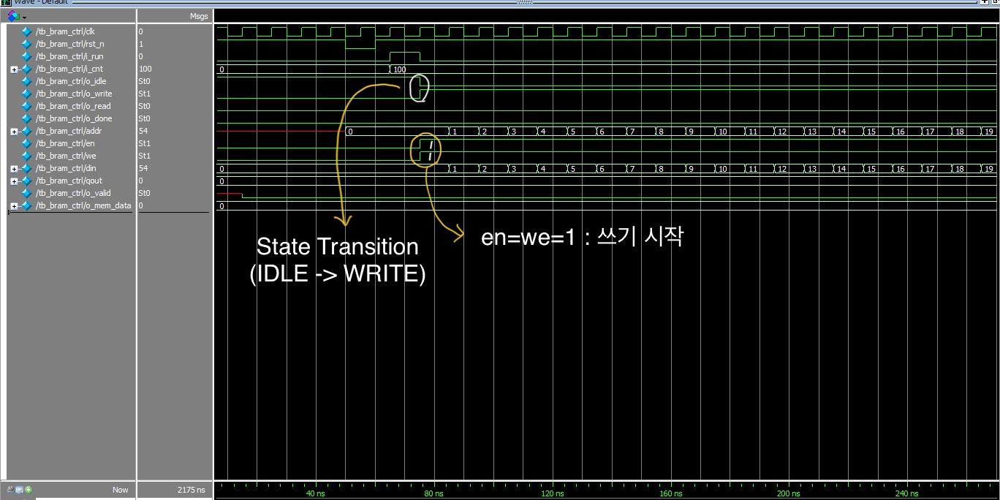
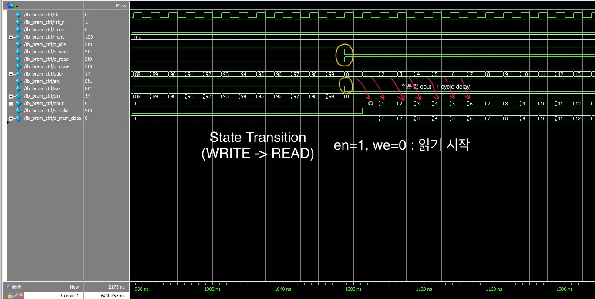
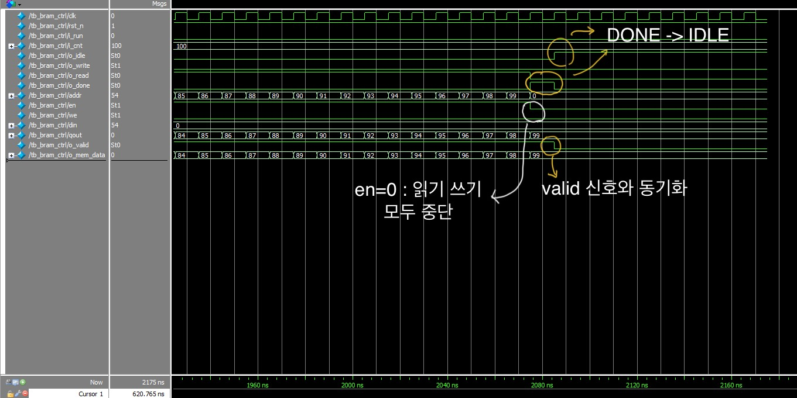

# Project_03_BRAM_Controller

## 1. 프로젝트 개요

이 프로젝트는 **Block RAM (BRAM)**에 데이터를 `i_cnt`번 쓰고 다시 읽어오는 과정을 FSM 구조로 제어하는 **메모리 컨트롤러 설계**입니다. `IDLE` -> `WRITE` -> `READ` -> `DONE` 으로 이어지는 순차적인 상태 전이를 통해 컨트롤러의 동작을 제어하며, BRAM과 연결된 memory interface를 제어합니다.
테스트벤치에서는 실제로 데이터를 0~99까지 BRAM에 쓰고 다시 읽어오는 동작을 검증하였습니다. 이 과정을 통해 동기 회로의 구조적 설계 방법과 메모리 제어 로직을 체계적으로 구성하는 방법을 학습했습니다.

---

## 2. 설계 목표

* FSM 기반의 상태 전이 구조 (IDLE → WRITE → READ → DONE)
* BRAM에 연속적인 데이터 쓰기 및 다시 읽기 기능 구현
* 데이터 쓰기/읽기 동작 완료 후 `o_done` 신호로 동작 종료 알림 후 `IDLE`상태로 복귀
* **입력 신호의 안정적인 유지를 위한 동기화 및 유효성 검증 로직 구현**

---

## 3. 설계 구현

### 3.1. 모듈 구성

| 모듈 이름       | 설명                                                                 |
|----------------|----------------------------------------------------------------------|
| `bram_ctrl`      | 전체 제어 FSM. 쓰기/읽기 상태 제어 및 주소, 제어 신호 생성 |
| `true_dpbram`    | true dual-port BRAM. read/write 포트 2개를 지원하며 실제 데이터를 저장 |
| `tb_bram_ctrl`   | 테스트벤치. 100개의 데이터를 쓰고 다시 읽는 동작을 시뮬레이션을 통해 검증 |

---

### 3.2. FSM 구조

**bram_ctrl** 모듈의 FSM은 다음과 같이 동작합니다:

| 상태(State) | 기능 설명                                                    |
|-------------|------------------------------------------------------------- |
| `IDLE`        | 입력 `i_run` 신호가 HIGH이고, `i_cnt`가 유효할 때 WRITE 상태로 전이 |
| `WRITE`       | `i_cnt` 횟수만큼 데이터를 BRAM에 쓰고 완료되면 READ 상태로 전이     |
| `READ`        | BRAM에서 데이터를 읽고 완료되면 DONE 상태로 전이                  |
| `DONE`        | 한 주기 완료 후 다시 IDLE로 전이                                  |


### 3.3. 설계에서 경험한 문제점 및 해결

#### **i_cnt > 0 조건이 필요한 이유**

처음에는 상태 전이 로직의 `IDLE`부분을 `if(i_run)`으로 구현했었습니다.
이 부분을 아래와 같이 디버깅 했습니다.
```verilog
IDLE : begin
  if(i_run && i_cnt>0);
~~
assign is_write_done = o_write && (addr_cnt == r_cnt - 1);
```

위 코드에서 r_cnt는 i_cnt를 클럭에 동기화시킨 내부 레지스터입니다. 만약 i_cnt == 0이면, r_cnt - 1은 -1이 되고, 이는 2의 보수 표현에서 0xFF...와 같이 모든 비트가 1인 상태가 됩니다.
이 경우 addr_cnt == r_cnt - 1 조건이 의도치 않게 바로 만족해서 WRITE 상태로 진입하자마자 **곧바로 DONE 상태로 넘어가 버려** 정상적인 쓰기/읽기 동작이 생략되는 버그가 발생할 수 있습니다. 이러한 경우를 방지하기 위해 `IDLE` 상태에서 `i_cnt > 0` 조건이 필요합니다.

#### **입력 신호 레지스터화 (i_cnt를 r_cnt로 저장)한 이유**
i_cnt는 외부에서 들어오는 비동기 입력입니다. 이 값을 클럭에 맞춰 동기화하지 않고 바로 내부 로직에서 사용할 경우, **glitch나 metastability가 발생**할 수 있습니다. 이는 디지털 회로에서 불안정하거나 예측 불가능한 동작을 유발할 수 있습니다.
그러므로 클럭의 `posedge clk`에서만 `i_cnt` 값을 받아 내부 레지스터 `r_cnt`에 저장함으로써 타이밍 안정성과 신뢰성 있는 동작을 설계하였습니다.

---

## 4. 시뮬레이션 및 검증 결과


`i_run=1`, `i_cnt`가 유효할 때 `IDLE` -> `WRITE`로 상태 전이가 발생하고 `WRITE`를 위해서 `en=1`,`we=1`이 활성화 됩니다. 

---


testbench에서 설정한 `i_cnt=100`의 횟수 만큼 '쓰기'를 한 후, `READ` 상태로 전이합니다.(`we=0`) `READ`의 경우 출력 `qout`은 한 사이클의 latency를 가집니다.

---


`i_cnt=100`의 횟수 만큼 '읽기'를 한 후, 'DONE' 상태로 전이합니다. `qout`이 한 사이클의 latency를 가지므로 `o_valid`를 통해 데이터의 유효성을 알립니다.
`o_done=1` 이후 다시 `IDLE` 상태로 전이하며 `WRITE`를 위한 `i_run`을 기다립니다.

---

## 5. 결론

이번 프로젝트를 통해 단순한 데이터 쓰기/읽기 뿐만 아니라, **동기화된 상태 제어, 메모리 인터페이스 제어, 그리고 안정적인 비동기 입력 처리 방식**에 대한 실질적인 경험을 쌓을 수 있었습니다.
특히 이 프로젝트를 통해 배운 점은 다음과 같은 것들이 있습니다.

>1. 입력 신호의 안정성 확보: 외부 비동기 입력을 내부에서 직접 사용하면 동작이 불안정할 수 있으므로, 반드시 클럭 동기화가 필요합니다.
 
>2. 예외적인 값에 대한 방어 로직: i_cnt=0과 같은 특수 케이스를 빠지지 않게 모두 고려하여 논리적으로는 올바르더라도 실질적으로 발생할 수 있는 오작동을 방지해야 합니다.

>3. 읽기 지연 처리 : BRAM의 읽기 결과는 한 사이클의 latency를 가지면서 출력되기 때문에 `o_valid`와 같은 동기 신호를 통해 타이밍 정렬이 필요합니다.

이러한 구조적 설계와 오류 방지 중심의 접근 방식은 향후 더 복잡한 메모리 컨트롤러, DMA, 캐시 컨트롤러 등으로 발전시킬 수 있는 좋은 기반이 되었습니다.
