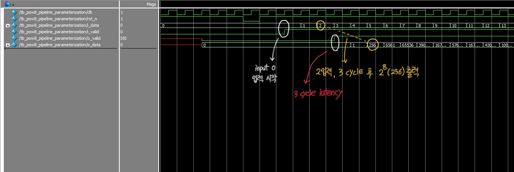
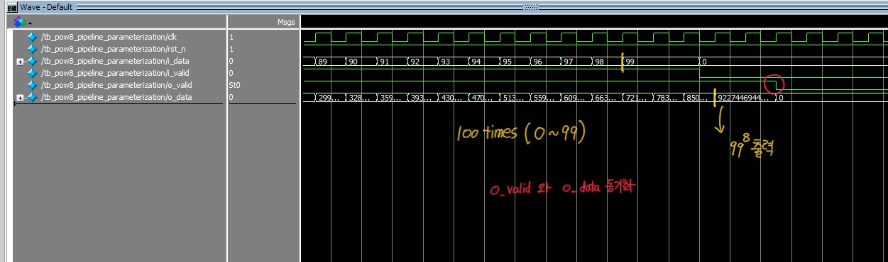

# Project_04_param_exp_pipe

## 1. 프로젝트 개요

이 프로젝트는 파라미터화된 파이프라인 구조를 통해 입력값 `i_data`에 대해 i_data^(a^b) (a는 연산 로직에 의해 변경 가능, default : a=2, `b=LATENCY`) 형태의 연산을 수행하는 **parameterized exponential pipelined calculator**입니다.  
입력값을 받은 후 각 파이프라인 단계마다 제곱 연산을 반복하며 결과값을 출력하는 구조로, 파라미터 `LATENCY`를 조정함으로써 출력 결과를 i_data^2, i_data^4, i_data^8 등으로 확장할 수 있습니다.

예를 들어 `LATENCY = 3`일 경우, 입력값 `i_data`에 대해 i_data^8 을 계산합니다.
테스트벤치에서 입력은 연속적인 숫자(0~99)로 주어지며, **입력 및 출력 모두에서 valid 신호를 동기화**하여 파이프라인 구조의 안정적인 동작을 검증합니다.

---

## 2. 설계 목표

* 파라미터화된 파이프라인 아키텍처 구현 : N단계 제곱 연산 -> i_data^(2^N)
* 1 클럭 당 1개의 입력 처리를 위한 **throughput = 1** 구조
* 입력 및 출력 유효 신호(`i_valid`, `o_valid`)를 통한 동기 제어
* 파이프라인 구조에서의 latency 동작 정확성 검증

---

## 3. 설계 구현

### 3.1. 모듈 구성

| 모듈 이름            | 설명  |
|---------------------|------------|
| `param_exp_pipe`    | 파라미터화된 파이프라인 모듈. 입력값에 대해 연속적인 제곱 연산을 수행하며 stage별로 결과를 레지스터링 |
| `tb_param_exp_pipe` | 입력값 0~99를 연속적으로 인가하고, 출력 결과의 타이밍 및 유효성을 검증   |

---

### 3.2. 파이프라인 구조 및 핵심 개념

**param_exp_pipe** 모듈은 다음과 같은 방식으로 동작합니다 :

1. **입력 처리**: `i_data`와 `i_valid`를 통해 연속적인 입력값과 값의 유효성을 입력받음
2. **연산 파이프라인**:
    - 첫 단계: i^2
    - 이후 단계: generate 블록을 통해 이전 제곱 결과를 다시 제곱, i^4, i^8, i^16 등으로 확장
    - 각 단계는 제곱 연산 후 파이프라인 레지스터를 통해 전달
3. **출력 처리**:
    - 마지막 stage에서 연산 결과는 `o_data`로 출력
    - 해당 출력이 유효함을 나타내는 `o_valid`는 내부 `valid shift register`를 통해 정확하게 전달됨

---

### 3.3. valid 신호의 중요성

이 프로젝트를 통해 파이프라인 구조에서 `valid` 신호의 중요성을 느낄 수 있었습니다.

> 파이프라인 구조에서는 각 연산 결과가 여러 클럭 이후에 도달하므로, 입력 시점의 유효성 정보를 함께 전달시켜야 신뢰성 높은 결과를 보장할 수 있습니다.
> 특히 다른 모듈의 input으로 들어가는 경우, 그 데이터의 유효성을 판단하기 위하여 `valid` 신호가 필수적입니다.

---

## 4. 시뮬레이션 및 검증 결과

`i_valid=1`과 함께 유효한 `i_data` 입력 시작, 첫 입력인 0에 대한 출력 0^8은 정확히 `LATENCY=3`을 가지며 `o_valid`를 통해 유효성 판별 가능

---

testbench에서 `MAX_INPUT_VALUE` 99로 설정 (총 100회), 마지막까지 `LATENCY=3`, `o_valid`의 일관성 확인

---

## 5. 결론

이번 프로젝트를 통해 다음과 같은 핵심 개념들을 실제 구현 및 시뮬레이션을 통해 직관적으로 이해할 수 있었습니다.

>1.**파라미터화된 파이프라인 구조의 설계 기법**  
>`generate` 문과 파라미터화를 통해 동일한 구조를 반복적으로 생성함으로써 모듈 재사용성과 확장성을 갖춘 설계를 구현할 수 있었습니다.
>이를 통해 다양한 연산 스테이지에 쉽게 대응할 수 있는 구조화된 설계 방식을 익혔습니다.

>2.**`valid` 신호의 중요성**  
>파이프라인 구조에서는 연산 결과가 여러 사이클 후에 출력되므로, 입력 시점의 유효성 정보를 함께 전달하는 것이 필수적입니다.  
>처음에는 이 설계가 비교적 단순하고 단일 모듈 기반이며, 협업이 아닌 개인 프로젝트였기 때문에 `i_valid`, `o_valid` 같은 유효성 신호의 필요성을 크게 느끼지 못했습니다.
>파이프라인처럼 내부에 지연이 있는 구조에서는 입출력 타이밍을 정확히 맞추지 않으면 결과가 언제 나오는지 알 수 없고, 신뢰하기 어렵기 때문에 `valid`신호가 필수적이고
>특히 협업 환경이나 더 큰 규모의 시스템에서 **신뢰성 있고 안정적인 동작을 보장하기 위한 핵심 설계 요소**라는 점을 배우게 되었습니다.

>3.**Latency vs Throughput 이해**
>파이프라인 구조는 3클럭의 latency를 가지지만 throughput은 1이기 때문에, **입력은 매 클럭마다 연속적으로 받을 수 있고**, 3사이클의 지연 후에는 결과도 매 클럭마다 끊기지 않고 출력되는 구조입니다.
>이러한 과정을 통해 파이프라인 구조의 핵심적인 장점을 직접 느낄 수 있었습니다.
>즉, 파이프라인은 연산이 완료되기까지 일정한 지연은 존재하지만, 한 번 흐름이 안정화되면 그 이후로는 매 클럭마다 결과를 출력할 수 있어 연속적이고 안정적인 데이터 처리가 가능합니다.
>이러한 구조는 단순히 빠른 처리뿐만 아니라, 대규모 시스템이나 고속 연산 유닛 설계에서 매우 중요한 설계 기법이라는 점을 직접 설계하고 시뮬레이션하며 배울 수 있었습니다.

---

이러한 파이프라인 구조와 타이밍 기반 제어 방식은 향후 **연산 유닛, 신호 처리 모듈, 또는 고속 데이터 경로 설계** 등으로 확장 가능한 중요한 개념이며,  
**모듈화된 설계와 신호 유효성 관리**에 대한 개념을 실습을 통해 체득했다는 점에서 매우 의미 있는 경험이 되었습니다.
