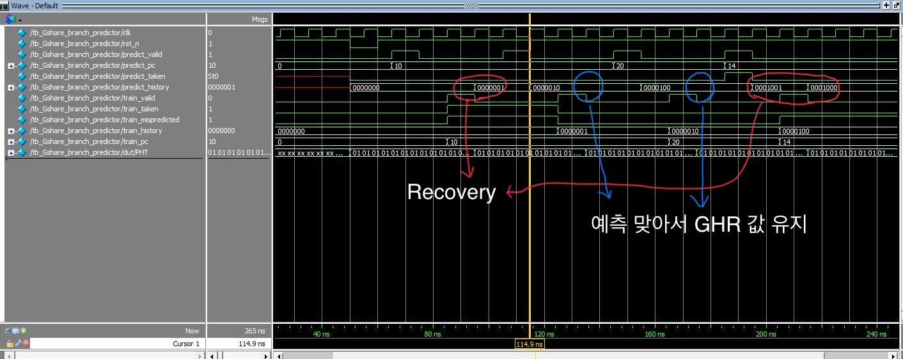
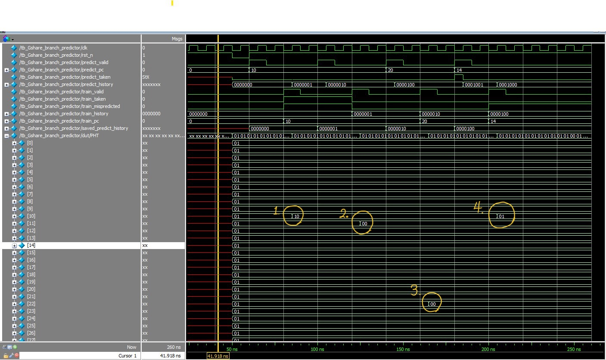

# Project_05_Gshare_branch_predictor

## 1. 프로젝트 개요
이 프로젝트는 **Global History Register(GHR) 및 Pattern History Table(PHT)** 을 이용하여 분기 방향을 예측하는 Gshare branch predictor를 구현한 것입니다.
현대 CPU 구조에서 branch predictor는 분기의 결과를 미리 예측하여 파이프라인 스톨(stall)을 줄이고, 고속 처리 성능을 유지하기 위해 필수적인 요소입니다. 그 중 Gshare은 PHT의 index를 결정하는 방식을 의미하며 다음과 같은 특징을 가집니다:

* 전역적인 분기 이력을 관리하는 GHR(Global History Register): 과거의 분기 결과(Taken, Not Taken)를 1비트씩 shift하며 저장

   -> 분기문을 만날 때마다 새로운 예측 결과를 GHR의 **LSB에 shift-in**하는 방식으로 업데이트되면서 가장 최근의 history가 LSB에 저장
  
* **Program Counter(PC)와 GHR을 XOR 기반 해싱(hashing) 방식으로 결합**하여 PHT 인덱스를 생성함으로써, 예측 테이블의 충돌을 줄이고 다양한 분기 패턴에 효과적으로 대응

* 각 인덱스마다 **2-bit saturating counter**로 구성된 **PHT**를 사용하여 예측 강도를 결정

* 전역적인 분기 이력을 관리하는 **GHR (Global History Register)**는 과거 분기 결과(Taken 또는 Not Taken)를 1비트씩 shift하며 저장합니다.  
  분기문을 만날 때마다 새로운 예측 결과를 GHR의 **MSB 쪽에 먼저 shift-in**하는 방식으로 업데이트되며, 이로 인해 최신 이력이 항상 앞쪽(MSB)에 위치하게 됩니다.  
  예: `GHR <= {GHR[5:0], predict_taken};`


---

## 2. 설계 목표

* GHR과 PHT를 활용한 Gshare 기반 branch prediction 구현  
* PC와 GHR의 XOR 결과를 PHT index로 사용  
* 각 PHT entry는 **2-bit saturating counter**로 동작
* 분기 예측 단계에서 예측에 따른 GHR 업데이트 로직
* 훈련 단계에서 훈련 값에 따라 예측 실패 판단, 실패 시 PHT 업데이트 및 GHR 복구 로직

---

## 3. 설계 구현

### 3.1. 모듈 구성

| 모듈 이름   | 설명 |
|----------------------------|------|
| `Gshare_branch_predictor`  | GHR과 2-bit PHT를 사용하여 분기 방향을 예측하고, 훈련 데이터로 업데이트하는 모듈 |
| `tb_Gshare_branch_predictor` | 다양한 분기 시나리오를 통해 예측과 훈련 과정을 시뮬레이션하는 테스트벤치 |


### 3.2. PHT 구조 및 예측 방식

* 2-bit saturating counter 정의
> `00`: Strong Not Taken

> `01`: Weak Not Taken
 
> `10`: Weak Taken

> `11`: Strong Taken 


* 예측 방식

>`PHT[index]`의 MSB가 1이면 **Taken**으로 예측, 0이면 **Not Taken**

* 훈련 방식
  
> `train_taken = 1` → counter를 +1 (최대값은 11)
> `train_taken = 0` → counter를 -1 (최소값은 00)

* 예측 실패 시
  
> GHR을 이전 GHR(예측 당시의 GHR(`train_history` + 실제 `train_taken`) 값으로 복구

```verilog
GHR <= { train_history[5:0], train_taken}; 
```

---

## 4. 시뮬레이션 및 검증 결과


예측 실패 시, GHR recovery logic

---


PHT update logic


| Test #  | PC 값 | GHR (XOR 대상) | Index 계산       | 초기 PHT 값 | 예측 결과 (MSB) | 실제 결과 | PHT update     | 최종 PHT 값 |
|---------|--------|----------------|------------------|-------------|------------------|------------|------------------|--------------|
| TEST_1  | 10     | 0              | 10 ^ 0 = 10      | 01          | Not Taken (0)    | Taken (1)  | 증가: 01 → 10     | 10           |
| TEST_2  | 10     | 1              | 10 ^ 1 = 11      | 01          | Not Taken (0)    | Not Taken (0) | 감소: 01 → 00     | 00           |
| TEST_3  | 20     | 2              | 20 ^ 2 = 22      | 01          | Not Taken (0)    | Not Taken (0) | 감소: 01 → 00     | 00           |
| TEST_4  | 14     | 4              | 14 ^ 4 = 10      | 10 (TEST_1) | Taken (1)        | Not Taken (0) | 감소: 10 → 01     | 01           |

---

1. **TEST_1 `PC=7'd10`**
   
-> PHT [10^0] = PHT[10] = 01 

-> predict_taken = 0

-> 실제 train_taken = 1

-> train_taken 1이므로 2-bit saturating counter 증가  01 -> 10

-> PHT[10] = 10

---

2. **TEST_2 `PC=7'd10`**
   
-> PHT[10^1] = PHT[11]= 01

-> predict_taken = 0

-> 실제 train_taken = 0

-> train_taken 0이므로 2-bit saturating counter 감소  01 -> 00

-> PHT[11] = 00;

---

3. **TEST_3 `PC=7'd20`**
   
-> PHT[20^2] = PHT[22] = 01

-> predict_taken = 0

-> 실제 train_taken = 0

-> train_taken 0이므로 2-bit saturating counter 감소  01 -> 00

->PHT[22] = 00;

---

4. **TEST_4 `PC=7'd14`**
   
-> PHT[14^4]= PHT[10] = 10  (TEST_1에 의해)

-> predict_taken = 1

-> 실제 train_taken =0

-> train_taken 0이므로 2-bit saturating counter 감소 10 -> 01

-> PHT[10] = 01;

---

## 5. 결론

이번 Gshare predictor 프로젝트를 통해 다음과 같은 주요 개념과 실습 경험을 얻었습니다

>**1. Branch Prediction 구조에 대한 이해**
>단순히 예측 신호를 출력하는 것이 아닌, **히스토리 기반 예측 구조의 필요성**, **XOR 해싱을 사용한 인덱싱 방식**, **2-bit saturating counter의 안정성** 등을 학습했습니다.

>**2. GHR 복구를 통한 예측 신뢰성 확보**
>예측 실패 시 GHR을 `train_history`로 되돌리는 기능을 통해, **분기 오차가 시스템 상태에 미치는 영향 최소화**를 설계에 반영할 수 있었습니다.

>**3. CPU 성능 향상을 위한 구조적 기법 학습**
>분기 예측 실패는 **파이프라인 스톨(stall)**로 이어지고 이는 성능 저하로 직결됩니다.  
>**Gshare**는 **Global History**를 이용하여 다양한 분기 패턴을 학습할 수 있으며, 그에 따라 **예측 정확도 향상 → CPU 성능 향상**이라는 구조적 장점을 가지고 있습니다.

---

이 프로젝트는 단순한 회로 설계를 넘어서, **마이크로아키텍처 수준의 성능 최적화**와 **구조 설계 개념**을 체득할 수 있는 유익한 실습이었습니다.


